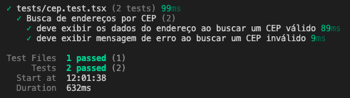

# Prova Técnica Frontend

Este é um exemplo de aplicação React que utiliza Typescript e Vite.

## Pré-requisitos

Antes de começar, você precisará ter as seguintes ferramentas instaladas no seu sistema:

- Node.js (>=18.x)
- Npm (>=8.x)
- Docker (>=20.x)

## Configuração Local

### 1. Clonar o Repositório

Clone este repositório para o seu ambiente local:

```bash
git clone https://github.com/JPedroCh/prova-tecnica-frontend.git
cd prova-tecnica-frontend
```

### 2. Instalar Dependências

Instale as dependências do projeto usando o NPM:

```bash
npm install
```

### 3. Configurar o .env

Crie um arquivo .env que tenha a variável de ambiente VITE_NEWS_API_URL para definir a url a ser utilizada para as requisições relacionadas a API de notícias.

```env
VITE_NEWS_API_URL=http://localhost:3001
```

OBS: O docker do backend utiliza a porta 3001.

### 4. Iniciar a Aplicação

Inicie a aplicação em ambiente de desenvolvimento:

```bash
npm run dev
```

A aplicação estará disponível em `http://localhost:8080`.

## Configuração com Docker

### 1. Construir a Imagem Docker

Para construir a imagem Docker e iniciar todos os contâiners definidos no `docker-compose.yml` execute:

```bash
docker-compose up --build
```

A aplicação estará disponível em `http://localhost:4173`.

## Testes

### BDD

O BDD é uma prática de desenvolvimento de software que envolve colaboração entre desenvolvedores, QA e não-programadores para definir o comportamento desejado de uma aplicação através de exemplos de uso compreensíveis para todos.

Os testes foram implementados utilizando o `vitest` e estão no arquivo `tests/cep.test.tsx`. Para executar os testes é preciso já ter executado o comando:

```bash
npm install
```

e então executar

```bash
npm run test
```

O resultado esperado é o seguinte:


## Contribuição

Se você deseja contribuir para este projeto, por favor siga estas etapas:

1. Fork o repositório
2. Crie uma nova branch (`git checkout -b feature/nova-funcionalidade`)
3. Commit suas alterações (`git commit -m 'Adiciona nova funcionalidade'`)
4. Push para a branch (`git push origin feature/nova-funcionalidade`)
5. Abra um Pull Request para a branch `develop`

## Estrutura de Pastas/Arquivos

```bash
my-app/
├── public/
├── src/
|   ├── assets/
│   ├── components/
│   ├── pages/
│   ├── routes/
│   ├── services/
│   ├── styles/
│   ├── App.tsx
│   ├── main.tsx
│   └── vite-env.d.ts
├── tests/
|   ├── cep.test.tsx
|   ├── setupTests.ts
├── .env.example
├── .eslintrc.cjs
├── .gitignore
├── .prettierignore
├── .prettierrc
├── docker-compose.yml
├── Dockerfile
├── index.html
├── package-lock.json
├── package.json
├── README.md
├── tsconfig.json
├── tsconfig.node.json
└── vite.config.ts
```

### Descrição das Pastas e Arquivos

- **`public/`** - Diretório onde estão imagens e arquivos públicos que serão servidos diretamente.
- **`src/`** - Diretório principal do código fonte da aplicação.
  - **`src/assets/`** - Arquivos estáticos como imagens, ícones e fontes usados na aplicação.
  - **`src/components/`** - Componentes de UI reutilizáveis que podem ser usados em toda a aplicação.
  - **`src/pages/`** - Componentes que representam páginas da aplicação.
  - **`src/routes/`** - Configuração das rotas da aplicação usando React Router.
  - **`src/services/`** - Serviços e APIs para comunicação com back-end e APIs externas.
  - **`src/styles/`** - Arquivos de estilo globais, temas ou variáveis de CSS/Styled Components.
  - **`src/App.tsx`** - Componente raiz da aplicação.
  - **`src/main.tsx`** - Ponto de entrada da aplicação React, renderiza o `App` no DOM.
  - **`src/vite-env.d.ts`** - Tipagens específicas para Vite e importações de arquivos estáticos.
- **`tests/`** - Diretório contendo testes da aplicação.
  - **`tests/cep.test.tsx`** - Testes relacionados à funcionalidade de busca de CEP.
  - **`tests/setupTests.ts`** - Arquivo de setup para testes (configurações globais, mocks, jest-dom/vitest).
- **`.env.example`** - Exemplo de variáveis de ambiente necessárias para rodar a aplicação.
- **`.eslintrc.cjs`** - Configuração do ESLint para linting do projeto.
- **`.gitignore`** - Arquivos e pastas que devem ser ignorados pelo Git.
- **`.prettierignore`** - Arquivos que o Prettier deve ignorar.
- **`.prettierrc`** - Configuração do Prettier para formatação de código.
- **`docker-compose.yml`** - Configuração de orquestração de containers Docker para desenvolvimento e produção.
- **`Dockerfile`** - Arquivo de definição da imagem Docker, incluindo multi-stage build se usado.
- **`index.html`** - Arquivo HTML principal da aplicação, ponto de entrada para o React.
- **`package.json`** - Lista de dependências, scripts e metadados do projeto.
- **`package-lock.json`** - Controle de versões exatas das dependências instaladas.
- **`README.md`** - Documentação do projeto.
- **`tsconfig.json`** - Configuração principal do TypeScript para a aplicação.
- **`tsconfig.node.json`** - Configuração do TypeScript específica para execução em Node.js (ex.: scripts, Vite).
- **`vite.config.ts`** - Configuração do Vite (build, plugins, testes, servidores de desenvolvimento).

### Descrição da Escolha de Padrão de Código

ESLint: Ajuda a manter o código limpo e seguro, evitando erros comuns em JavaScript, TypeScript e React, além de reforçar boas práticas com hooks e suportar o hot reload sem problemas.

Prettier: Mantém o código visualmente consistente, tornando mais fácil de ler e manter, e evita divergências sobre estilo em revisões de PR.

## Licença

Este projeto está licenciado sob a MIT License - veja o arquivo [LICENSE](LICENSE) para mais detalhes.
